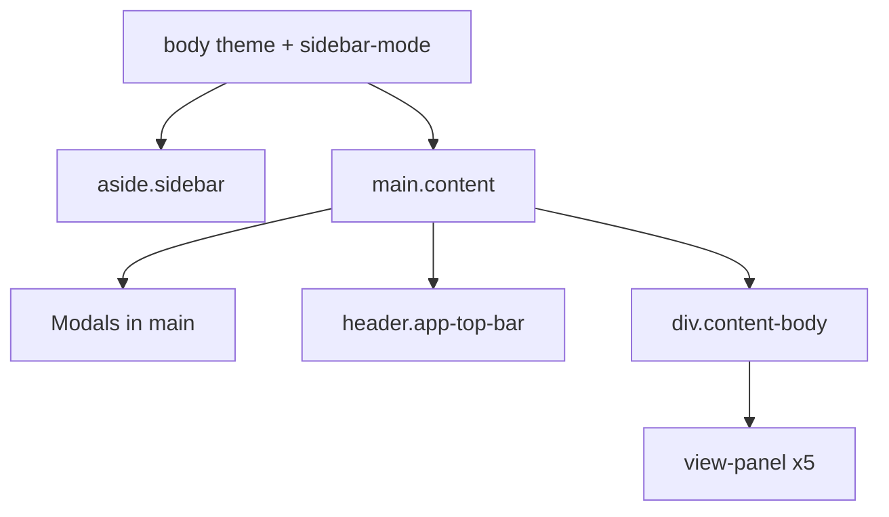

# FlowAssist GUI Legend (`legend.md`)

## Goal

Give you a single reference so requests like *"increase padding on the Today's Productivity pill"* or *"hide the subtask View Type dropdown when collapsed"* map to exact DOM targets without guesswork. The deliverable is **[legend.md](legend.md)** at the repo root (filename per your request: `legend` → `legend.md`).

## What we already know (architecture)

FlowAssist is a single-page Electron app: static shell in [index.html](index.html), styles in [styles.css](styles.css), all behavior and dynamic markup in [renderer.js](renderer.js).

**View routing:** `state.view` is one of `list | calendar | summary | notes | relax`. Panels use `#view-{name}` + class `view-panel`; active panel gets `active`. Sidebar nav uses `data-view` on `.nav-btn`; top bar duplicates via `.top-bar-view-screen`.

**Sidebar layout:** `body` classes `sidebar-mode-full | sidebar-mode-collapsed | sidebar-mode-hidden` (set in `applySidebarLayout()`). Theme: `theme-classic | theme-refined` on `body`.

**Dynamic UI:** Task cards, subtasks, progress rows, calendar grids, and note cards are HTML strings from `renderTaskCard`, `renderSubtaskCard`, `renderCalendar`, `renderNoteCardHtml` — not in `index.html`.

Existing automation: [tests/discovery/ui-mapper.spec.js](tests/discovery/ui-mapper.spec.js) dumps Chromium accessibility trees to `tests/ui-map/` (useful supplement, not the primary legend).

---

## `legend.md` structure (sections to write)

### 1. How to use this legend

- **Preferred name** (human label, e.g. "Top bar — Date pill")
- **Canonical selector** (prefer `#id` when stable; else `.class` + `data-*`)
- **View / region** (where it lives)
- **Static vs dynamic** (shell vs `renderer.js` template)
- **Example surgical request** (one line each)

Naming rules to document:

| Layer | Convention |
|-------|------------|
| Regions | `sidebar`, `top-bar`, `content-body`, `view-{name}` |
| Modals | `{name}-modal` id on wrapper, `.modal-backdrop`, `.modal-content` |
| Tasks | `.task-card` + `data-id`; expanded: `.task-body` |
| Subtasks | `.subtask-card` + `data-task-id` + `data-subtask-id` |
| Shared widgets | `.filter-dropdown-wrap`, `.rich-textarea-wrap`, `.meta-chip` |

### 2. Global shell (from [index.html](index.html))

Document every stable control with id:

| Region | Key ids / classes |
|--------|-------------------|
| **Sidebar** | `#sidebar-rail-toggle`, `.sidebar-nav` `.nav-btn[data-view]`, `#settings-btn`, `#app-version-line` |
| **Top bar** | `#top-bar-view-btn` / `#top-bar-view-menu`, `#top-bar-metrics` pills (`#top-bar-date-pill`, `#top-bar-today-productivity-pill`, `#top-bar-week-productivity-pill`), `#top-bar-relax-timers` / focus & break pills, `#notif-wrap`, `#top-bar-sidebar-toggle` |
| **Modals** | `#settings-modal`, `#export-options-modal`, `#progress-history-modal`, `#notes-modal` — each field id (`#setting-theme`, `#setting-priority-1`…`10`, etc.) |

### 3. View: List (`#view-list`)

**Static:**

- **List filter tabs:** `#list-view-tab-bar` → `.list-view-tab[data-list-filter]` (`all`, `today`, `yesterday`, `archive`)
- **Main tasks header:** `.main-tasks-heading-row`, `#main-task-filter-btn` / `#main-task-filter-menu`
- **Lists:** `#task-list`, `#completed-task-list`
- **Add task:** `#add-new-task-btn`, `#add-new-task-block`, fields `#task-title`, `#task-project`, `#task-description`, `#task-priority`, etc., `#add-task-btn`
- **Done section:** `.completed-tasks-section`

**Dynamic (task card — from `renderTaskCard`):**

- **Collapsed ribbon:** `.task-bar` (priority background), `.task-bar-title`, `.task-bar-meta` `.meta-chip`, `.task-bar-highlights` `.bar-highlight`, `.task-bar-subtasks` badges
- **Expanded body:** `.task-body` → status `.status-buttons`, flags `.task-summary-export-flags`, toggles `.task-update-toggles`, collapsible blocks `.task-details-block`, `.task-update-eta-block`, `.task-update-effort-block`, `.task-description-block`, `.task-progress-block`, `.task-subtasks-block`
- **Subtask block:** `.subtasks-heading-row`, subtask sort `.subtask-filter-wrap`, **View Type** `.subtask-viewtype-wrap`, `.subtask-list` → `.subtask-card`
- **New subtask:** `.new-subtask-block`, `.new-subtask-form`

**Dynamic (subtask card — from `renderSubtaskCard`):**

- `.subtask-bar` / `.subtask-body`, `.status-buttons-sub`, panels mirror main task at smaller scope (`.subtask-details-block`, progress with `.subtask-progress-*` classes)

**Progress log (shared):** `.progress-list-wrap`, `.progress-log-nav-*`, `.progress-item`, `.progress-add`, `.btn-progress-history-open` → opens `#progress-history-modal`

### 4. View: Calendar (`#view-calendar`)

**Toolbar:** `.calendar-toolbar` — chart style `.calendar-chart-style-btn[data-chart-style]`, view `.calendar-view-btn[data-calendar-view]`, `#calendar-prev-btn` / `#calendar-next-btn`, `#calendar-period-label`, `#calendar-goto-date`, `#calendar-filter`, day-off `#calendar-dayoff-toggle` / `#calendar-dayoff-panel` and form ids

**Rendered in `#calendar-container`:**

- **Basic:** `.calendar-day-card`, `.calendar-day-tasks`, off badges `.calendar-day-off-badge`
- **Gantt:** `.gantt-grid`, `.gantt-task-bar`, `.gantt-task-dropdown`, date cells `.gantt-date-cell`

### 5. View: Summary (`#view-summary`)

`#summary-from`, `#summary-to`, `#generate-summary-btn`, `#summary-export-format`, `#export-options-btn`, `#export-summary-btn`, output `#summary-output` (export HTML uses `.summary-task-card`, `.summary-progress-*`)

### 6. View: Notes (`#view-notes`)

Toolbar: `#notes-grid-columns-select`, `#notes-add-note-btn`, `#notes-add-todo-btn`; filter bar `#notes-toolbar-filter` with `#notes-filter-mode` and conditional inputs; board `#notes-board`

**Dynamic note card** (`.notes-card`, `data-note-id`, modifiers `--note` / `--todo`, `--accent-0..3`, `--readonly`, `--modal`):

- Note: `.notes-card-body` / display variant
- Todo list: `.notes-checklist`, `.notes-todo-done`, `.notes-checklist-add`
- Reminders: `.notes-card-reminders`, `.notes-reminder-*`
- Editor modal: `#notes-modal` → `#notes-modal-body` (full card re-rendered with `--modal`)

### 7. View: Relax (`#view-relax`)

Sections: Timers (`.relax-card--break` `#relax-card-break`, `.relax-card--work` `#relax-card-focus`), Casual games (`#relax-toggle-desert-run`, `#relax-desert-run-panel`, iframe `#relax-minigame-dino`), Wind down (`#relax-tip-card`). Top-bar mirror: `#top-bar-relax-focus-pill`, `#top-bar-relax-break-pill`.

### 8. Shared components glossary

Cross-cutting patterns used in multiple views:

- **Filter dropdown:** `.filter-dropdown-wrap` → `.filter-dropdown-btn` + `.filter-dropdown-menu` + `.filter-option`
- **Category picker:** `.category-dropdown-wrap` (generated id prefix e.g. `task-detail-category-{taskId}`)
- **Rich text:** `.rich-textarea-wrap[data-rich-wysiwyg="1"]`, `.rich-format-toolbar`, `.rich-fmt-btn[data-rich-cmd]`, `.rich-markdown-wysiwyg`
- **Collapsible panels:** `.task-toggleable-block` + `.task-block-collapsed`
- **Buttons:** `.btn-primary`, `.btn-secondary`, `.btn-small`, `.btn-update-toggle`, `.btn-icon`
- **Meta display:** `.meta-chip`, `.meta-label`, `.meta-value`, highlight states `.hl-overdue`, `.hl-urgent`, `.hl-done`

### 9. Body / state classes quick reference

- Sidebar: `sidebar-mode-full | collapsed | hidden`
- Theme: `theme-classic | theme-refined`
- Task expanded: `.task-card.expanded`
- Subtask expanded: `.subtask-card.expanded`
- Calendar: `#view-calendar.calendar-basic-fill` when basic chart style

### 10. Appendix: full id inventory

Alphabetical table of all `#...` ids from `index.html` plus documented dynamic id patterns (`task-detail-project-{id}`, `subtask-detail-category-{taskId}-{subtaskId}`, etc.).

---

## Execution steps (after you approve)

1. Re-scan [index.html](index.html) for any ids/classes missed in this pass.
2. Extract dynamic class/id patterns from `renderTaskCard`, `renderSubtaskCard`, `renderProgress*`, `renderCalendar`, `renderNoteCardHtml`, `renderSummary*` in [renderer.js](renderer.js).
3. Write [legend.md](legend.md) with the structure above (~400–700 lines, tables + nested bullet trees, no emojis).
4. Optionally add a one-line pointer in [README](README.md) or project docs linking to `legend.md` (only if you want it discoverable in-repo; skip unless you ask).

No application code changes beyond adding the markdown file.

## How you will reference UI after this

Examples the legend will enable:

- *"In **top bar**, widen **Week's Productivity pill** (`#top-bar-week-productivity-pill`)"*
- *"In **List view → expanded task → Update ETA block** (`.task-update-eta-block`), change the history chain styling"*
- *"On **subtask bar** (`.subtask-bar`), move **Effort spent** meta-chip after **ETA**"*

---

## Out of scope (unless you ask later)

- Screenshots or visual wireframes
- Regenerating `tests/ui-map/` snapshots
- Renaming ids/classes in code for consistency
- Playwright test updates
