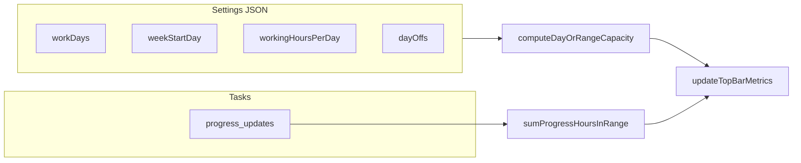

# Top bar date and productivity metrics

## Context

The top bar lives in [`index.html`](c:\Users\padma\OneDrive\Documents\Projects-Darwin\flow-assist\index.html) (`#app-top-bar`). Focus/Break timers are conditional pills in `#top-bar-relax-timers`. Settings are edited in the **Settings modal** (sidebar gear), not a separate tab — new fields go in the existing **General** section beside `workingHoursPerDay`.

Effort is already tracked via `progress_updates[].effort_consumed_hours` and `date_added`. Capacity math exists in [`computeBandwidthUtilized`](c:\Users\padma\OneDrive\Documents\Projects-Darwin\flow-assist\renderer.js) but hardcodes **Mon–Fri** (`dow !== 0 && dow !== 6`) and **Monday week start** (`getMonday`). No top-bar metrics exist today.



## 1. New settings (schema + UI)

Add to `DEFAULT_SETTINGS` and `setData()` normalization in [`renderer.js`](c:\Users\padma\OneDrive\Documents\Projects-Darwin\flow-assist\renderer.js):

| Key | Type | Default | Validation |
|-----|------|---------|------------|
| `workDays` | `number[]` (0=Sun … 6=Sat) | `[1,2,3,4,5]` | At least one day; dedupe; sort |
| `weekStartDay` | `number` | `1` (Monday) | 0–6 |

**Settings modal** ([`index.html`](c:\Users\padma\OneDrive\Documents\Projects-Darwin\flow-assist\index.html) General section, after working hours):

- **Default work days** — 7 labeled checkboxes (`#setting-work-day-0` … `#setting-work-day-6`), hint: used for productivity targets, bandwidth, and deadline working-day counts.
- **Week starts on** — `<select id="setting-week-start">` with Sun–Sat options.

Wire in `openSettingsModal()`, settings save handler (~9852), and `saveSettings()` merge so existing `dayOffs`, `relax`, etc. are preserved.

## 2. Shared date/work-week helpers

Refactor [`renderer.js`](c:\Users\padma\OneDrive\Documents\Projects-Darwin\flow-assist\renderer.js) date utilities (replace hardcoded weekend/Monday assumptions):

- `getNormalizedWorkDays(settings)` / `getNormalizedWeekStartDay(settings)`
- `isConfiguredWorkDayYMD(ymd, settings)` — uses `workDays` + `parseYMD`
- `getWeekStartYMD(ymd, weekStartDay)` — generalize `getMonday` (keep `getMonday` as thin alias or replace all call sites)
- `getWorkWeekRangeForDate(todayYmd, settings)` → `{ from, to }` where `from` is week-start on or before `today`, `to = from + 6 days` (7-day window anchored to `weekStartDay`)
- `computeDayCapacityHours(ymd, settings)` — same rules as today’s loop in `computeBandwidthUtilized`: full day off → 0; partial → `workingHoursPerDay - hoursOff`; non-work-day → 0; else → `workingHoursPerDay`
- `computeRangeCapacityHours(from, to, settings)` — iterate dates, sum `computeDayCapacityHours` only on configured work days

Update consumers to use settings-aware helpers:

- `computeBandwidthUtilized` — replace `dow !== 0 && dow !== 6` with `isConfiguredWorkDayYMD`
- `workingDaysUntil` — skip days not in `workDays` (and full day offs, unchanged)
- `getWeekDates` / `setSummaryDefaultDates` — use `getWeekStartYMD` + `weekStartDay`
- Calendar month grid padding — replace `(firstDay.getDay() + 6) % 7` with `(firstDay.getDay() - weekStartDay + 7) % 7`
- `isWeekendYMD` — redefine as “not a configured work day” so Gantt/calendar non-work tinting matches settings (optional small behavior change, keeps UX consistent)

## 3. Top bar markup and styles

**HTML** — Restructure `top-bar-center` in [`index.html`](c:\Users\padma\OneDrive\Documents\Projects-Darwin\flow-assist\index.html):

```html
<div class="top-bar-center">
  <div class="top-bar-metrics" id="top-bar-metrics" aria-live="polite">
    <span class="top-bar-info-pill" id="top-bar-date-pill">...</span>
    <span class="top-bar-info-pill top-bar-info-pill--wide" id="top-bar-today-productivity-pill">...</span>
    <span class="top-bar-info-pill top-bar-info-pill--wide" id="top-bar-week-productivity-pill">...</span>
  </div>
  <div id="top-bar-relax-timers" hidden>...</div>
</div>
```

**CSS** ([`styles.css`](c:\Users\padma\OneDrive\Documents\Projects-Darwin\flow-assist\styles.css)):

- `.top-bar-metrics` — flex row, wrap, centered, gap consistent with relax pills
- `.top-bar-info-pill` — non-clickable pill matching relax pill height/typography (label + value, no hover cursor)
- `.top-bar-info-pill--wide` — `min-width` (~220–280px) so long labels do not collapse
- Reuse `.top-bar-relax-pill-label` / `.top-bar-relax-pill-sep` / value styling where practical for visual consistency

## 4. Metrics computation and updates

Add `updateTopBarMetrics()` in [`renderer.js`](c:\Users\padma\OneDrive\Documents\Projects-Darwin\flow-assist\renderer.js):

**Date pill** (`Date:` label per request):

- Text: `Date: Mon, May 25, 2026` (weekday short + numeric date); reuse `formatCalendarDate` / `toLocaleDateString` patterns from ~1376.

**Today's Productivity** (per your format choice: **hours with unit**):

- Numerator: `sumProgressHoursInRangeForTasksWithSummaryFilter(tasks, today, today)`
- Denominator: `computeDayCapacityHours(today, settings)` (from `workingHoursPerDay` + day offs + work days)
- Display: `Today's Productivity: 3.5 hrs / 8 hrs` (one decimal, trim `.0`)

**Week's Productivity**:

- Range: `getWorkWeekRangeForDate(today)` → `weekStart` … `weekEnd`
- Numerator: spent from `weekStart` through `today` (inclusive)
- Denominator: **full work-week planned capacity** — `computeRangeCapacityHours(weekStart, weekEnd, settings)` (all configured work days in the 7-day window, minus full/partial offs)
- Display: `Week's Productivity: 12 hrs / 40 hrs`

Edge cases: non-work-day today → `0 hrs / 0 hrs`; after settings save or progress log, values refresh.

**Call sites**:

- `render()` — alongside `updateRelaxTopBarPills()` (~9235)
- Settings save success handler
- Optional lightweight midnight refresh: `setInterval` checking date rollover (low cost; avoids stale date if app stays open overnight)

## 5. Tests

Extend [`tests/regression/settings-modal.spec.js`](c:\Users\padma\OneDrive\Documents\Projects-Darwin\flow-assist\tests\regression\settings-modal.spec.js):

- Toggle work days (e.g. uncheck Friday), save, reopen — checkboxes reflect saved state
- Change week start to Sunday, save, persist after reload

Add [`tests/regression/top-bar-metrics.spec.js`](c:\Users\padma\OneDrive\Documents\Projects-Darwin\flow-assist\tests\regression\top-bar-metrics.spec.js):

- `#top-bar-metrics` visible on load
- Date pill contains today's weekday
- Productivity pills match `Label:` pattern with `hrs`

## 6. Files to touch

| File | Changes |
|------|---------|
| [`index.html`](c:\Users\padma\OneDrive\Documents\Projects-Darwin\flow-assist\index.html) | Top bar metrics markup; settings fields |
| [`styles.css`](c:\Users\padma\OneDrive\Documents\Projects-Darwin\flow-assist\styles.css) | Info pill + wide variant |
| [`renderer.js`](c:\Users\padma\OneDrive\Documents\Projects-Darwin\flow-assist\renderer.js) | Settings defaults/normalize/save/load; work-week helpers; refactor capacity/week; `updateTopBarMetrics` |
| [`tests/regression/settings-modal.spec.js`](c:\Users\padma\OneDrive\Documents\Projects-Darwin\flow-assist\tests\regression\settings-modal.spec.js) | New settings persistence |
| [`tests/regression/top-bar-metrics.spec.js`](c:\Users\padma\OneDrive\Documents\Projects-Darwin\flow-assist\tests\regression\top-bar-metrics.spec.js) | New |

README: optional one-line note under Settings describing work days / week start (only if you want docs updated).

## Layout note

Metrics stay **always visible** in the center; relax Focus/Break pills remain conditional below/wrapped in the same `top-bar-center` flex container so both can appear when timers run.
