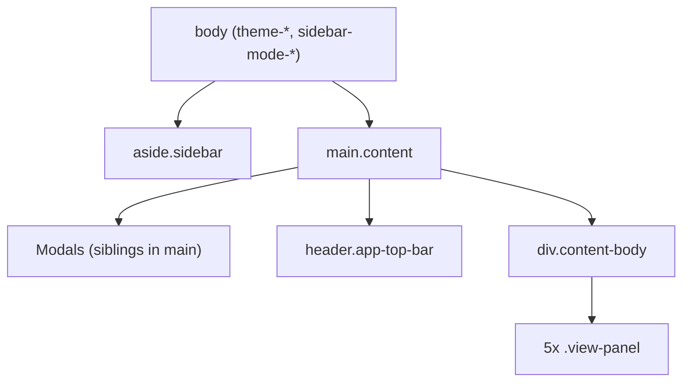

# FlowAssist GUI Legend

Reference for naming and targeting UI elements when requesting changes. Source of truth: [index.html](index.html) (static shell), [renderer.js](renderer.js) (dynamic markup), [styles.css](styles.css) (presentation).

---

## How to use this legend

When asking for a change, use this pattern:

**`[Region] → [Preferred name] → [selector]`**

Example: *"In **Top bar**, increase padding on **Week's Productivity pill** (`#top-bar-week-productivity-pill`)."*

### Fields in each entry

| Field | Meaning |
|-------|---------|
| **Preferred name** | Human label used in conversation |
| **Selector** | Stable `#id`, `.class`, or `[data-*]` for code/tests |
| **Region** | Where it appears in the app |
| **Source** | `static` = in `index.html`; `dynamic` = built in `renderer.js` |

### Naming conventions

| Layer | Convention |
|-------|------------|
| App regions | `sidebar`, `top-bar`, `content-body`, `view-{name}` |
| Views | `list`, `calendar`, `summary`, `notes`, `relax` — match `state.view` and `data-view` |
| Modals | Wrapper `#…-modal`, inner `.modal-content`, dismiss via `.modal-backdrop` |
| Main tasks | `.task-card` + `data-id="{taskId}"`; expanded adds `.expanded` and `.task-body` |
| Sub-tasks | `.subtask-card` + `data-task-id` + `data-subtask-id` |
| Collapsible blocks | `.task-toggleable-block` without `.task-block-collapsed` = open |

### Surgical request examples

| Request style | Example |
|---------------|---------|
| By id | "Change `#top-bar-date-value` font size." |
| By region + class | "In **List view**, style `.task-bar-highlights` when overdue." |
| By data attribute | "When `.nav-btn[data-view='notes']` is active, …" |
| Scoped to expanded task | "Inside `.task-card.expanded .task-update-eta-block`, …" |
| Dynamic pattern | "Category dropdown on task `{id}`: `#task-detail-category-{id}`" |

---

## App architecture

**View switching:** Sidebar `.nav-btn[data-view]` and top bar `.top-bar-view-screen[data-view]` set `state.view`. Visible panel: `#view-{view}.view-panel.active`.

**Files:** `index.html` structure · `renderer.js` behavior and templates · `styles.css` layout/theme.

**Optional AX dump:** Run `tests/discovery/ui-mapper.spec.js` → `tests/ui-map/last-snapshot.json`.

---

## Global shell

### Document root (`body`)

| Preferred name | Selector | Notes |
|----------------|----------|-------|
| Body | `body` | Root |
| Theme — Classic | `body.theme-classic` | From Settings → Theme |
| Theme — Refined | `body.theme-refined` | |
| Sidebar — full width | `body.sidebar-mode-full` | Labels visible |
| Sidebar — icons only | `body.sidebar-mode-collapsed` | Rail toggle or View menu |
| Sidebar — hidden | `body.sidebar-mode-hidden` | Top bar sidebar toggle |

---

### Sidebar (`aside.sidebar`)

| Preferred name | Selector | Source |
|----------------|----------|--------|
| Sidebar | `aside.sidebar` | static |
| Sidebar title | `.sidebar-title` | static — "FlowAssist" |
| Sidebar rail toggle | `#sidebar-rail-toggle` | static — collapse to icons / expand |
| Sidebar navigation | `.sidebar-nav` | static |
| Nav button — List | `.nav-btn[data-view="list"]` | static |
| Nav button — Calendar | `.nav-btn[data-view="calendar"]` | static |
| Nav button — Summary | `.nav-btn[data-view="summary"]` | static |
| Nav button — Notes | `.nav-btn[data-view="notes"]` | static |
| Nav button — Relax | `.nav-btn.nav-btn--relax[data-view="relax"]` | static |
| Nav button (active) | `.nav-btn.active` | static |
| Nav icon / label | `.nav-btn-icon`, `.nav-btn-text` | static |
| Settings button | `#settings-btn` | static |
| App version line | `#app-version-line` | static — filled by JS |

---

### Top bar (`header.app-top-bar`)

| Preferred name | Selector | Source |
|----------------|----------|--------|
| Top bar | `header.app-top-bar` | static |
| Top bar — start | `.top-bar-start` | static |
| Top bar — center | `.top-bar-center` | static |
| Top bar — end | `.top-bar-end` | static |
| View menu wrap | `#top-bar-view-wrap` | static |
| View menu button | `#top-bar-view-btn` | static — "View ▾" |
| View menu dropdown | `#top-bar-view-menu` | static |
| View menu — screen group label | `.top-bar-menu-group-label` (first) | static |
| View menu — screen items | `.top-bar-view-screen[data-view]` | static — list, calendar, summary, notes, relax |
| View menu — separator | `.top-bar-menu-sep` | static |
| View menu — sidebar width label | `.top-bar-menu-group-label` (second) | static |
| View menu — Full width | `.top-bar-sidebar-opt[data-sidebar-mode="full"]` | static |
| View menu — Icons only | `.top-bar-sidebar-opt[data-sidebar-mode="collapsed"]` | static |
| Metrics container | `#top-bar-metrics` | static |
| Date pill | `#top-bar-date-pill` | static |
| Date pill label | `.top-bar-metric-label` (inside date pill) | static |
| Date pill value | `#top-bar-date-value` | static |
| Today's Productivity pill | `#top-bar-today-productivity-pill` | static |
| Today's Productivity value | `#top-bar-today-productivity-value` | static |
| Week's Productivity pill | `#top-bar-week-productivity-pill` | static |
| Week's Productivity value | `#top-bar-week-productivity-value` | static |
| Relax timers group | `#top-bar-relax-timers` | static — shown when a timer runs |
| Focus timer pill (top bar) | `#top-bar-relax-focus-pill` | static |
| Focus timer time (top bar) | `#top-bar-relax-focus-time` | static |
| Break timer pill (top bar) | `#top-bar-relax-break-pill` | static |
| Break timer time (top bar) | `#top-bar-relax-break-time` | static |
| Notifications wrap | `#notif-wrap` | static |
| Notification bell | `#notif-bell-btn` | static |
| Notification badge | `#notif-badge` | static |
| Notification dropdown | `#notif-dropdown` | static |
| Notification list | `#notif-list` | static — items injected |
| Notification empty state | `#notif-empty` | static |
| Sidebar hide/show toggle | `#top-bar-sidebar-toggle` | static — `aria-pressed` when hidden |

**Dynamic notification item** (in `#notif-list`):

| Preferred name | Selector |
|----------------|----------|
| Notification item | `.notif-item` (with `data-notif-task-id`, optional `data-notif-subtask-id`) |

---

### Main content area

| Preferred name | Selector | Source |
|----------------|----------|--------|
| Main content | `main.content` | static |
| Content body | `.content-body` | static — holds view panels |
| View panel (generic) | `.view-panel` | static |
| Active view panel | `.view-panel.active` | static |

---

## Modals (global)

All modals: outer `#…-modal.modal`, `.modal-backdrop`, inner `.modal-content`. Open state: `aria-hidden="false"` on modal (wired in JS).

### Settings modal

| Preferred name | Selector | Source |
|----------------|----------|--------|
| Settings modal | `#settings-modal` | static |
| Settings dialog title | `#settings-dialog-title` | static |
| Settings modal header/body/footer | `.settings-modal-header`, `.settings-modal-body`, `.settings-modal-footer` | static |
| Theme field | `#setting-theme` | static |
| Working hours per day | `#setting-working-hours` | static |
| Default work days label | `#setting-work-days-legend` | static |
| Work day checkbox Sun–Sat | `#setting-work-day-0` … `#setting-work-day-6` | static |
| Week starts on | `#setting-week-start` | static |
| Category types (CSV) | `#setting-categories` | static |
| Project names (CSV) | `#setting-projects` | static |
| Priority color P1–P10 | `#setting-priority-1` … `#setting-priority-10` | static |
| Settings Cancel | `#settings-cancel-btn` | static |
| Settings Save | `#settings-save-btn` | static |

### Export options modal

| Preferred name | Selector | Source |
|----------------|----------|--------|
| Export options modal | `#export-options-modal` | static |
| Export options title | `#export-options-title` | static |
| Show progress entry hours checkbox | `#export-opt-show-progress-hrs` | static |
| Export options Done | `#export-options-done-btn` | static |

### Progress history modal

| Preferred name | Selector | Source |
|----------------|----------|--------|
| Progress history modal | `#progress-history-modal` | static |
| Progress history title | `#progress-history-title` | static |
| Progress history close | `#progress-history-close-btn` | static |
| Progress history sort | `#progress-history-sort` | static |
| Progress history scroll body | `#progress-history-modal-scroll` | static — list filled by JS |

### Notes editor modal

| Preferred name | Selector | Source |
|----------------|----------|--------|
| Notes modal | `#notes-modal` | static |
| Notes modal title (a11y) | `#notes-modal-title` | static — visually hidden |
| Notes modal body | `#notes-modal-body` | static — full `.notes-card--modal` injected |

---

## View: List (`#view-list`)

### List chrome (static)

| Preferred name | Selector | Source |
|----------------|----------|--------|
| List view panel | `#view-list` | static |
| List filter tab bar | `#list-view-tab-bar` | static |
| Tab — All Tasks | `.list-view-tab[data-list-filter="all"]` | static |
| Tab — Today | `.list-view-tab[data-list-filter="today"]` | static |
| Tab — Yesterday | `.list-view-tab[data-list-filter="yesterday"]` | static |
| Tab — Archive | `.list-view-tab[data-list-filter="archive"]` | static |
| Tab — Effort Wise | `.list-view-tab[data-list-filter="effortwise"]` | static — green label |
| Active list tab | `.list-view-tab.active` | static |
| Effort Wise toolbar | `#effort-wise-toolbar` | static — visible when Effort Wise tab active |
| Effort Wise period label | `#effort-wise-period-label` | static |
| Effort Wise previous / next | `#effort-wise-prev-btn`, `#effort-wise-next-btn` (`.effort-wise-icon-btn`) | static |
| Effort Wise date picker | `#effort-wise-goto-date` | static — hidden input; opened via calendar button |
| Effort Wise calendar button | `#effort-wise-calendar-btn` (`.effort-wise-icon-btn`) | static |
| Effort Wise toolbar separator | `.effort-wise-toolbar-sep` | static |
| Effort Wise Day / Week | `.effort-wise-granularity-btn[data-effort-granularity]` | static — `day`, `week` |
| Main tasks heading row | `.main-tasks-heading-row` | static |
| Main tasks heading | `.main-tasks-heading` | static — "Main Tasks List" |
| Main task sort button | `#main-task-filter-btn` | static |
| Main task sort menu | `#main-task-filter-menu` | static |
| Sort options | `.filter-option[data-sort-by][data-sort-dir]` | static — date_added, priority, eta |
| Active task list container | `#task-list` | static |
| Add task separator | `.add-task-separator` | static |
| Add New Task toggle | `#add-new-task-btn` | static |
| Add new task form block | `#add-new-task-block` | static — collapsible |
| Add task — Title | `#task-title` | static |
| Add task — Project | `#task-project` | static |
| Add task — Description (WYSIWYG) | `#task-description` | static |
| Add task — Category dropdown mount | `#add-task-category-dropdown` | static — JS injects dropdown |
| Add task — Priority | `#task-priority` | static |
| Add task — Difficulty | `#task-difficulty` | static |
| Add task — Tags | `#task-tags` | static |
| Add task — Assigned | `#task-assigned` | static |
| Add task — ETA | `#task-eta` | static |
| Add task — Effort | `#task-effort` | static |
| Add task — Bug ID | `#task-bug` | static |
| Add Task submit | `#add-task-btn` | static |
| Done section | `.completed-tasks-section` | static |
| Done heading | `.completed-tasks-heading` | static |
| Completed task list | `#completed-task-list` | static |

---

### Task card (dynamic — `renderTaskCard`)

| Preferred name | Selector | Source |
|----------------|----------|--------|
| Task card | `.task-card[data-id="{taskId}"]` | dynamic |
| Expanded task card | `.task-card.expanded` | dynamic |
| Task bar (ribbon) | `.task-bar[data-task-id]` | dynamic — background = priority color |
| Task bar — left column | `.task-bar-left` | dynamic |
| Task bar title row | `.task-bar-title-row` | dynamic |
| Project pill on bar | `.task-bar-project-pill` | dynamic |
| Task title on bar | `.task-bar-title` | dynamic |
| Concerns count pill on bar | `.bar-concerns-pill` | dynamic |
| Task meta chips row | `.task-bar-meta` | dynamic |
| Meta chip (generic) | `.meta-chip` | dynamic |
| Meta chip — Status | `.meta-chip-status` | dynamic |
| Meta chip — Category | `.meta-chip-categories` / `.meta-chip-category` | dynamic |
| Meta chip — ETA | `.meta-chip-eta` | dynamic |
| Meta chip — Effort | `.meta-chip-effort` | dynamic |
| Meta chip — Effort spent | `.meta-chip-spent` | dynamic |
| Meta label / value | `.meta-label`, `.meta-value` | dynamic |
| Default/empty meta value | `.meta-value.default-value` | dynamic |
| Highlights row | `.task-bar-highlights` | dynamic |
| Highlight chip | `.bar-highlight` | dynamic |
| Highlight — overdue | `.bar-highlight.hl-overdue` | dynamic |
| Highlight — urgent (≤3 days) | `.bar-highlight.hl-urgent` | dynamic |
| Highlight — done/dropped | `.bar-highlight.hl-done` | dynamic |
| Highlight separator | `.bar-highlight-sep` | dynamic |
| Subtasks summary on bar | `.task-bar-subtasks` | dynamic |
| Subtask count | `.subtask-count-wrap`, `.subtask-count-value` | dynamic |
| Subtask status badges | `.badge-open`, `.badge-ongoing`, `.badge-done`, `.badge-dropped` | dynamic |

**Expanded task body** (`.task-body`):

| Preferred name | Selector | Source |
|----------------|----------|--------|
| Task body | `.task-body` | dynamic |
| Task body actions | `.task-body-actions` | dynamic |
| Status buttons (main task) | `.status-buttons[data-status-target="task"]` | dynamic |
| Status button | `.status-btn[data-status]` | dynamic — Open, Ongoing, Done, Dropped |
| Active status button | `.status-btn.active` | dynamic |
| Delete task | `.task-delete` | dynamic |
| Summary/export flags row | `.task-summary-export-flags` | dynamic |
| Exclude from summary | `.task-exclude-summary` | dynamic |
| Exclude from export | `.task-exclude-export` | dynamic |
| No effort needed | `.task-no-effort-needed` | dynamic |
| Archive checkbox | `.task-archive-check` | dynamic — when task done |
| Update section toggles | `.task-update-toggles` | dynamic |
| Toggle — Update Task Details | `.btn-update-details` | dynamic |
| Toggle — Update ETA | `.btn-update-eta` | dynamic |
| Toggle — Update Effort | `.btn-update-effort` | dynamic |
| Toggle — Update Status Changes | `.btn-update-status-changes` | dynamic |
| Toggle — Concerns | `.btn-add-concern-toggle` | dynamic |
| Active update toggle | `.btn-update-toggle.active` | dynamic |

**Collapsible blocks** (`.task-toggleable-block`; hidden when `.task-block-collapsed`):

| Preferred name | Selector | Source |
|----------------|----------|--------|
| Task details block | `.task-details-block` | dynamic |
| Task details title | `.task-details-title` | dynamic |
| Task details grid | `.task-details-grid` | dynamic |
| Task detail — title input | `.task-detail-title` | dynamic |
| Task detail — priority | `.task-detail-priority` | dynamic |
| Task detail — difficulty | `.task-detail-difficulty` | dynamic |
| Task detail — tags | `.task-detail-tags` | dynamic |
| Task detail — assigned | `.task-detail-assigned` | dynamic |
| Task detail — ETA | `.task-detail-eta` | dynamic |
| Task detail — effort | `.task-detail-effort` | dynamic |
| Task detail — bugs | `.task-detail-bugs` | dynamic |
| Task detail — category wrap | `.task-detail-category-wrap` | dynamic |
| Task detail — category dropdown id | `#task-detail-category-{taskId}` | dynamic |
| Task detail — project wrap | `.task-detail-project-wrap` | dynamic |
| Task detail — project select id | `#task-detail-project-{taskId}` | dynamic |
| Save task details | `.save-task-details-btn` | dynamic |
| Update ETA block | `.task-update-eta-block` | dynamic |
| ETA update input | `.task-update-eta-in` | dynamic |
| Update ETA button | `.update-eta-btn` | dynamic |
| ETA history chain | `.task-update-history-eta` | dynamic |
| Update Effort block | `.task-update-effort-block` | dynamic |
| Effort update input | `.task-update-effort-in` | dynamic |
| Update Effort button | `.update-effort-btn` | dynamic |
| Status changes block | `.task-update-status-changes-block` | dynamic |
| Status change list | `.status-change-list` | dynamic |
| Status change item | `.status-change-item[data-status-change-id]` | dynamic |
| Status change pill | `.status-change-pill` | dynamic |
| Concerns block | `.task-concerns-block` | dynamic |
| Concern list | `.concern-list` | dynamic |
| Concern item | `.concern-item[data-concern-id]` | dynamic |
| Addressed concern | `.concern-item-addressed` | dynamic |
| Log concern form | `.concern-add-form` | dynamic |
| Description block | `.task-description-block` | dynamic |
| Description view | `.task-description-view` | dynamic |
| Description edit (WYSIWYG) | `.task-description-edit`, `.task-description-wysiwyg` | dynamic |
| Toggle description edit | `.toggle-desc-edit` | dynamic |
| Progress block | `.task-progress-block` | dynamic |
| Progress add row | `.progress-add` | dynamic |
| Progress text input | `.progress-text-in` | dynamic |
| Progress date input | `.progress-date-in` | dynamic |
| Progress effort input | `.progress-effort-in` | dynamic |
| Add progress button | `.add-progress-btn` | dynamic |
| Sub-tasks block | `.task-subtasks-block` | dynamic |
| Sub-tasks heading row | `.subtasks-heading-row` | dynamic |
| Sub-tasks title | `.subtasks-title` | dynamic |
| Subtask sort dropdown | `.subtask-filter-wrap[data-task-id]` | dynamic |
| Subtask View Type dropdown | `.subtask-viewtype-wrap[data-task-id]` | dynamic |
| Subtask visibility checkbox | `.subtask-vis-cb[data-vis-key]` | dynamic |
| Subtask viewport toolbar | `.subtask-viewport-toolbar` | dynamic |
| Subtask list | `.subtask-list` | dynamic |
| Subtask empty filter message | `.subtask-view-empty` | dynamic |
| New Sub-Task toggle | `.btn-new-subtask` | dynamic |
| New subtask block | `.new-subtask-block` | dynamic |
| New subtask form | `.new-subtask-form` | dynamic |
| New subtask title | `.new-subtask-title-in` | dynamic |
| New subtask description | `.new-subtask-desc-in` | dynamic |
| Add Sub-Task submit | `.add-subtask-submit-btn` | dynamic |

---

### Sub-task card (dynamic — `renderSubtaskCard`)

| Preferred name | Selector | Source |
|----------------|----------|--------|
| Subtask card | `.subtask-card[data-task-id][data-subtask-id]` | dynamic |
| Expanded subtask | `.subtask-card.expanded` | dynamic |
| Subtask bar | `.subtask-bar` | dynamic |
| Subtask bar title | `.subtask-bar-title` | dynamic |
| Subtask bar meta | `.subtask-bar-meta` | dynamic |
| Subtask bar right (status + delete) | `.subtask-bar-right` | dynamic |
| Subtask status buttons | `.status-buttons-sub` | dynamic |
| Delete subtask | `.subtask-delete` | dynamic |
| Subtask body | `.subtask-body` | dynamic |
| Subtask flags | `.subtask-summary-export-flags` | dynamic |
| Subtask update toggles | `.subtask-update-toggles` | dynamic |
| Subtask details block | `.subtask-details-block` | dynamic |
| Subtask detail title | `.subtask-detail-title` | dynamic |
| Subtask detail fields | `.subtask-detail-priority`, `.subtask-detail-assigned`, etc. | dynamic |
| Category id pattern | `#subtask-detail-category-{taskId}-{subtaskId}` | dynamic |
| Project id pattern | `#subtask-detail-project-{taskId}-{subtaskId}` | dynamic |
| Save subtask details | `.save-subtask-details-btn` | dynamic |
| Subtask description block | `.subtask-description-block` | dynamic |
| Toggle subtask desc edit | `.toggle-subtask-desc-edit` | dynamic |
| Subtask progress text/date/effort | `.subtask-progress-text`, `.subtask-progress-date`, `.subtask-progress-effort` | dynamic |
| Add subtask progress | `.add-subtask-progress-btn` | dynamic |

---

### Progress log (dynamic — shared main/subtask)

| Preferred name | Selector | Source |
|----------------|----------|--------|
| Progress list wrap | `.progress-list-wrap[data-progress-log-key]` | dynamic |
| Progress log controls | `.progress-log-controls` | dynamic |
| Progress log nav up/down | `.progress-log-nav-up`, `.progress-log-nav-down` | dynamic |
| Progress log range label | `.progress-log-range` | dynamic |
| Progress log sort (inline) | `.progress-log-sort-select` | dynamic |
| All history button | `.btn-progress-history-open` | dynamic |
| Progress list | `.progress-list` / `.progress-list-sub` | dynamic |
| Progress item | `.progress-item[data-update-id]` | dynamic |
| Progress meta line | `.progress-meta` | dynamic |
| Progress text body | `.progress-text` | dynamic |
| Edit progress button | `.btn-edit-progress` / `.btn-edit-subtask-progress` | dynamic |
| Progress item edit panel | `.progress-item-edit` | dynamic |
| Save progress | `.progress-save-btn` | dynamic |
| Delete progress | `.progress-delete-btn` | dynamic |

**Progress log keys:** `m:{taskId}` (main), `s:{taskId}:{subtaskId}` (subtask).

---

## View: Calendar (`#view-calendar`)

### Toolbar (static)

| Preferred name | Selector | Source |
|----------------|----------|--------|
| Calendar view panel | `#view-calendar` | static |
| Calendar basic fill mode | `#view-calendar.calendar-basic-fill` | dynamic class |
| Calendar toolbar | `.calendar-toolbar` | static |
| Chart style group | `.calendar-chart-style-group` | static |
| Chart style — Basic | `.calendar-chart-style-btn[data-chart-style="basic"]` | static |
| Chart style — Gantt | `.calendar-chart-style-btn[data-chart-style="gantt"]` | static |
| Calendar view group | `.calendar-view-group` | static |
| Calendar view — Day/Week/Month | `.calendar-view-btn[data-calendar-view]` | static |
| Calendar prev/next | `#calendar-prev-btn`, `#calendar-next-btn` | static |
| Calendar period label | `#calendar-period-label` | static |
| Go to date | `#calendar-goto-date` | static |
| Show tasks by row | `#calendar-filter-row` | static |
| Calendar filter select | `#calendar-filter` | static — assigned vs eta |
| Day offs toggle | `#calendar-dayoff-toggle` | static |
| Day offs panel | `#calendar-dayoff-panel` | static |
| Day off — date | `#dayoff-date` | static |
| Day off — type | `#dayoff-type` | static |
| Day off — reason | `#dayoff-reason` | static |
| Day off — hours row | `#dayoff-hours-row` | static |
| Day off — hours | `#dayoff-hours` | static |
| Log day off | `#calendar-dayoff-add-btn` | static |
| Day off browse mode | `#calendar-dayoff-view-mode` | static |
| Day off nav | `#calendar-dayoff-nav` | static |
| Day off period label | `#calendar-dayoff-period-label` | static |
| Day off prev/next | `#calendar-dayoff-prev`, `#calendar-dayoff-next` | static |
| Day off list scroll | `#calendar-dayoff-list-scroll` | static |
| Day off list | `#calendar-dayoff-list` | static |
| Calendar render mount | `#calendar-container` | static |

**Dynamic day off list item:** `.calendar-dayoff-list li` with `.calendar-dayoff-remove[data-dayoff-id]`.

### Calendar grid (dynamic — `renderCalendar`)

**Basic chart** (`state.calendarChartStyle === 'basic'`):

| Preferred name | Selector | Source |
|----------------|----------|--------|
| Calendar title | `.calendar-title` | dynamic |
| Calendar days grid | `.calendar-days` | dynamic |
| Day view grid | `.calendar-view-day` | dynamic |
| Week view grid | `.calendar-view-week` | dynamic |
| Month view grid | `.calendar-view-month` | dynamic |
| Day cell | `.calendar-day[data-date]` | dynamic |
| Empty month padding slot | `.calendar-day-empty-slot` | dynamic |
| Today day cell | `.calendar-day-today` | dynamic |
| Weekend day cell | `.calendar-day-weekend` | dynamic |
| Full day off cell | `.calendar-day-off-full` | dynamic |
| Partial day off cell | `.calendar-day-off-partial` | dynamic |
| Day name / date | `.calendar-day-name`, `.calendar-day-date` | dynamic |
| Day off badge | `.calendar-day-off-badge` | dynamic |
| Tasks on day list | `.calendar-day-tasks` | dynamic |
| Task status pill (calendar) | `.task-status-pill` | dynamic |
| Empty day message | `.calendar-day-empty` | dynamic |

**Gantt chart** (`state.calendarChartStyle === 'gantt'`):

| Preferred name | Selector | Source |
|----------------|----------|--------|
| Gantt grid | `.gantt-grid`, `.gantt-grid-week`, `.gantt-grid-month` | dynamic |
| Gantt date header cell | `.gantt-date-cell[data-date]` | dynamic |
| Gantt today header | `.gantt-date-cell-today` | dynamic |
| Gantt weekend/off header classes | `.gantt-date-cell-weekend`, `.gantt-date-cell-off-full`, `.gantt-date-cell-off-partial` | dynamic |
| Gantt task bar | `.gantt-task-bar[data-task-id]` | dynamic |
| Gantt task bar title | `.gantt-task-bar-title` | dynamic |
| Gantt task dropdown | `.gantt-task-dropdown` | dynamic |
| Gantt dropdown inner | `.gantt-task-dropdown-inner` | dynamic |
| Gantt subtask list | `.gantt-dropdown-subtask-list` | dynamic |
| Gantt grid filler | `.gantt-grid-filler` | dynamic |
| Empty period message | `.empty-state` | dynamic |

---

## View: Summary (`#view-summary`)

### Toolbar (static)

| Preferred name | Selector | Source |
|----------------|----------|--------|
| Summary view panel | `#view-summary` | static |
| Summary toolbar | `.summary-toolbar` | static |
| Summary from date | `#summary-from` | static |
| Summary to date | `#summary-to` | static |
| Generate Summary | `#generate-summary-btn` | static |
| Export format select | `#summary-export-format` | static |
| Export options button | `#export-options-btn` | static |
| Export Summary | `#export-summary-btn` | static |
| Summary output area | `#summary-output` | static |

### Generated summary content (dynamic)

Rendered into `#summary-output` after Generate; export builds separate HTML/CSS artifacts.

| Preferred name | Selector | Source |
|----------------|----------|--------|
| Summary task card | `.summary-task-card` | dynamic |
| Summary progress item | `.summary-progress-item` | dynamic |
| Summary progress line 1 | `.summary-progress-line1` | dynamic |
| Summary progress description | `.summary-progress-desc` | dynamic |
| Summary progress category pill | `.summary-progress-category-pill` | dynamic |
| Summary progress effort | `.summary-progress-effort` | dynamic |
| Export split HTML textarea | `.summary-export-text[data-copy-id="html"]` | dynamic |
| Export split CSS textarea | `.summary-export-text[data-copy-id="css"]` | dynamic |

---

## View: Notes (`#view-notes`)

### Toolbar and filters (static)

| Preferred name | Selector | Source |
|----------------|----------|--------|
| Notes view panel | `#view-notes` | static |
| Notes toolbar | `.notes-toolbar` | static |
| Notes toolbar title/sub | `.notes-toolbar-title`, `.notes-toolbar-sub` | static |
| Per row columns select | `#notes-grid-columns-select` | static |
| New note button | `#notes-add-note-btn` | static |
| New list (todo) button | `#notes-add-todo-btn` | static |
| Notes filter bar | `#notes-toolbar-filter` | static |
| Filter mode | `#notes-filter-mode` | static |
| Filter day input | `#notes-filter-day` | static |
| Filter month input | `#notes-filter-month` | static |
| Filter range wrap | `#notes-filter-range-wrap` | static |
| Filter range from/to | `#notes-filter-from`, `#notes-filter-to` | static |
| Filter Apply | `#notes-filter-apply` | static |
| Filter Clear | `#notes-filter-clear` | static |
| Notes board | `#notes-board` | static |

### Note / todo card (dynamic — `renderNoteCardHtml`)

| Preferred name | Selector | Source |
|----------------|----------|--------|
| Note card | `.notes-card[data-note-id]` | dynamic |
| Note card — note type | `.notes-card--note` | dynamic |
| Note card — todo/list type | `.notes-card--todo` | dynamic |
| Accent variant | `.notes-card--accent-0` … `--accent-3` | dynamic |
| Board preview (readonly) | `.notes-card--readonly` | dynamic |
| Modal variant | `.notes-card--modal` | dynamic |
| Card top row | `.notes-card-top` | dynamic |
| Delete note button | `.notes-card-delete` | dynamic |
| Card head inner | `.notes-card-head-inner` | dynamic |
| Note title input | `.notes-card-title` | dynamic |
| Title display (readonly) | `.notes-card-title-display` | dynamic |
| Created date pill | `.notes-card-date-pill` | dynamic |
| Note body (editable) | `.notes-card-body` | dynamic |
| Note body display | `.notes-card-body-display` | dynamic |
| Todo checklist | `.notes-checklist` | dynamic |
| Checklist item | `.notes-checklist-item[data-item-id]` | dynamic |
| Todo done checkbox | `.notes-todo-done` | dynamic |
| Todo rich text | `.notes-todo-text` | dynamic |
| Todo stats pills | `.notes-todo-stats-pills`, `.notes-todo-stat-pill--total` etc. | dynamic |
| Add checklist item | `.notes-checklist-add` | dynamic |
| Truncated items hint | `.notes-checklist-truncated` | dynamic |
| Reminders section wrap | `.notes-card-reminders` | dynamic |
| Reminder pill (compact) | `.notes-reminder-pill` | dynamic |
| Reminder dropdown toggle | `.notes-reminder-dropdown-toggle` | dynamic |
| Reminder dropdown panel | `.notes-reminder-dropdown` | dynamic |
| Reminder datetime | `#nr-dt-{noteId}` | dynamic |
| Reminder countdown | `#nr-num-{noteId}` | dynamic |
| Reminder preset buttons | `.notes-reminder-preset[data-min]` | dynamic |
| Save reminder | `.notes-reminder-save-btn` | dynamic |

---

## View: Relax (`#view-relax`)

### Layout (static)

| Preferred name | Selector | Source |
|----------------|----------|--------|
| Relax view panel | `#view-relax` | static |
| Relax toolbar | `.relax-toolbar` | static |
| Section label — Timers | `#relax-section-timers-label` | static |
| Timers grid | `.relax-grid--timers` | static |

### Break timer card (`#relax-card-break`)

| Preferred name | Selector | Source |
|----------------|----------|--------|
| Break timer card | `#relax-card-break` | static |
| Break timer display | `#relax-break-display` | static |
| Break presets | `.relax-preset-btn[data-relax-break-min]` | static |
| Break Start / Reset | `#relax-break-start`, `#relax-break-reset` | static |
| Break hours/minutes display | `#relax-break-hours`, `#relax-break-minutes` | static |
| Break steppers | `#relax-break-hours-up/down`, `#relax-break-minutes-up/down` | static |

### Focus timer card (`#relax-card-focus`)

| Preferred name | Selector | Source |
|----------------|----------|--------|
| Focus block card | `#relax-card-focus` | static |
| Focus timer display | `#relax-work-display` | static |
| Focus sapling animation | `#relax-focus-sapling-wrap` | static |
| Focus presets | `.relax-work-preset-btn[data-relax-work-min]` | static |
| Focus Start / Reset | `#relax-work-start`, `#relax-work-reset` | static |
| Focus hours/minutes | `#relax-work-hours`, `#relax-work-minutes` | static |
| Focus steppers | `#relax-work-hours-up/down`, `#relax-work-minutes-up/down` | static |

### Casual games

| Preferred name | Selector | Source |
|----------------|----------|--------|
| Section label — Casual games | `#relax-section-casual-label` | static |
| Desert Run toggle | `#relax-toggle-desert-run` | static |
| Desert Run panel | `#relax-desert-run-panel` | static |
| Dino game iframe | `#relax-minigame-dino` | static |
| Game focus hint | `.relax-game-focus-hint` | static |

### Wind down

| Preferred name | Selector | Source |
|----------------|----------|--------|
| Section label — Wind down | `#relax-section-wind-label` | static |
| Wellbeing tip card | `#relax-tip-card` | static |
| Tip title / body | `#relax-tip-title`, `#relax-tip-body` | static |
| Next tip button | `#relax-tip-next` | static |
| Timer chime checkbox | `#relax-sound-enabled` | static |

---

## Shared components glossary

### Filter dropdown

| Part | Selector |
|------|----------|
| Wrap | `.filter-dropdown-wrap` |
| Trigger | `.filter-dropdown-btn` |
| Menu | `.filter-dropdown-menu` |
| Menu item | `.filter-option` |
| Checkbox menu variant | `.filter-dropdown-menu-checks` |

### Category dropdown (dynamic id optional)

| Part | Selector |
|------|----------|
| Wrap | `.category-dropdown-wrap` |
| Button | `.category-dropdown-btn` |
| Panel | `.category-dropdown-panel` |
| Checkbox row | `.category-checkbox-label`, `.category-checkbox` |

### Project select

| Part | Selector |
|------|----------|
| Select | `.task-project-select` |

### Rich text / WYSIWYG

| Part | Selector |
|------|----------|
| Wrap | `.rich-textarea-wrap[data-rich-wysiwyg="1"]` |
| Toolbar | `.rich-format-toolbar` |
| Format button | `.rich-fmt-btn[data-rich-cmd]` — bold, italic, underline, bullet, numlist, code, codeblock |
| Editable surface | `.rich-markdown-wysiwyg` |
| Auto-resize helper | `.auto-resize`, `.rich-text-target` |

### Buttons (common classes)

| Class | Typical use |
|-------|-------------|
| `.btn-primary` | Primary actions |
| `.btn-secondary` | Secondary / cancel-adjacent |
| `.btn-small` | Compact actions |
| `.btn-cyan` | Add sub-task, accent actions |
| `.btn-update-toggle` | Expand task update sections |
| `.btn-icon` | Icon-only delete etc. |
| `.btn-edit-cyan` | Edit description / progress |
| `.btn-link` | Text-style cancel |

### Meta and status styling

| Class | Meaning |
|-------|---------|
| `.hl-overdue` | Past ETA or over effort |
| `.hl-urgent` | ETA within 3 days |
| `.hl-dim` | Placeholder text (e.g. No ETA) |
| `.muted` | De-emphasized helper text |
| `.hidden` | Display none (JS toggled) |
| `.visually-hidden` | Screen-reader only |

### Collapsible blocks

| State | Selector |
|-------|----------|
| Block | `.task-toggleable-block` |
| Collapsed | `.task-block-collapsed` (on same element) |

---

## `data-*` attribute reference

| Attribute | Where | Values / meaning |
|-----------|-------|------------------|
| `data-view` | `.nav-btn`, `.top-bar-view-screen` | `list`, `calendar`, `summary`, `notes`, `relax` |
| `data-sidebar-mode` | `.top-bar-sidebar-opt` | `full`, `collapsed` |
| `data-list-filter` | `.list-view-tab` | `all`, `today`, `yesterday`, `archive`, `effortwise` |
| `data-sort-by` | `.filter-option` | `date_added`, `priority`, `eta`, `assigned_date` |
| `data-sort-dir` | `.filter-option` | `asc`, `desc` |
| `data-chart-style` | `.calendar-chart-style-btn` | `basic`, `gantt` |
| `data-calendar-view` | `.calendar-view-btn` | `day`, `week`, `month` |
| `data-relax-break-min` | `.relax-preset-btn` | Minutes |
| `data-relax-work-min` | `.relax-work-preset-btn` | Minutes |
| `data-id` | `.task-card` | Task UUID |
| `data-task-id` | `.task-bar`, `.subtask-card`, gantt, progress buttons | Task UUID |
| `data-subtask-id` | `.subtask-card`, progress buttons | Subtask UUID |
| `data-note-id` | `.notes-card`, reminder controls | Note UUID |
| `data-item-id` | `.notes-checklist-item` | Checklist row UUID |
| `data-update-id` | `.progress-item` | Progress entry UUID |
| `data-status` | `.status-btn` | `Open`, `Ongoing`, `Done`, `Dropped` |
| `data-status-target` | `.status-buttons` | `task` or `subtask` |
| `data-vis-key` | `.subtask-vis-cb` | `Open`, `Ongoing`, `Done`, `Dropped` |
| `data-rich-cmd` | `.rich-fmt-btn` | Format command name |
| `data-placeholder` | contenteditable | Placeholder text (custom) |

---

## Appendix A: Static element IDs (`index.html`)

Alphabetical list of stable `#id` values:

| ID | Preferred name |
|----|----------------|
| `add-new-task-block` | Add new task form block |
| `add-new-task-btn` | Add New Task toggle |
| `add-task-btn` | Add Task button |
| `add-task-category-dropdown` | Add-task category mount |
| `app-version-line` | App version line |
| `calendar-container` | Calendar render area |
| `calendar-dayoff-add-btn` | Log day off |
| `calendar-dayoff-list` | Day off list |
| `calendar-dayoff-list-scroll` | Day off list scroll |
| `calendar-dayoff-nav` | Day off period nav |
| `calendar-dayoff-next` | Day off next period |
| `calendar-dayoff-panel` | Day offs panel |
| `calendar-dayoff-period-label` | Day off period label |
| `calendar-dayoff-prev` | Day off prev period |
| `calendar-dayoff-toggle` | Day offs toggle |
| `calendar-dayoff-view-mode` | Day off browse mode |
| `calendar-filter` | Show tasks by |
| `calendar-filter-row` | Calendar filter row |
| `calendar-goto-date` | Go to date |
| `calendar-next-btn` | Calendar next |
| `calendar-period-label` | Calendar period label |
| `calendar-prev-btn` | Calendar previous |
| `completed-task-list` | Done tasks list |
| `dayoff-date` | Day off date |
| `dayoff-hours` | Day off hours |
| `dayoff-hours-row` | Day off hours row |
| `dayoff-reason` | Day off reason |
| `dayoff-type` | Day off type |
| `export-options-done-btn` | Export options Done |
| `export-options-modal` | Export options modal |
| `export-options-title` | Export options title |
| `export-opt-show-progress-hrs` | Show progress hours checkbox |
| `export-summary-btn` | Export Summary |
| `generate-summary-btn` | Generate Summary |
| `list-view-tab-bar` | List filter tabs |
| `main-task-filter-btn` | Main task Sort button |
| `main-task-filter-menu` | Main task sort menu |
| `notif-badge` | Notification badge |
| `notif-bell-btn` | Notification bell |
| `notif-dropdown` | Notification dropdown |
| `notif-empty` | Notifications empty |
| `notif-list` | Notification list |
| `notif-wrap` | Notifications wrap |
| `notes-add-note-btn` | New note |
| `notes-add-todo-btn` | New list |
| `notes-board` | Notes board |
| `notes-filter-apply` | Notes filter Apply |
| `notes-filter-clear` | Notes filter Clear |
| `notes-filter-day` | Notes filter day |
| `notes-filter-from` | Notes filter range from |
| `notes-filter-mode` | Notes filter mode |
| `notes-filter-month` | Notes filter month |
| `notes-filter-range-wrap` | Notes filter range wrap |
| `notes-filter-to` | Notes filter range to |
| `notes-grid-columns-select` | Notes per row |
| `notes-modal` | Notes editor modal |
| `notes-modal-body` | Notes modal body |
| `notes-modal-title` | Notes modal a11y title |
| `notes-toolbar-filter` | Notes filter bar |
| `progress-history-close-btn` | Progress history close |
| `progress-history-modal` | Progress history modal |
| `progress-history-modal-scroll` | Progress history body |
| `progress-history-sort` | Progress history sort |
| `progress-history-title` | Progress history title |
| `relax-break-display` | Break timer display |
| `relax-break-hours` | Break hours value |
| `relax-break-hours-down` | Break hours down |
| `relax-break-hours-up` | Break hours up |
| `relax-break-minutes` | Break minutes value |
| `relax-break-minutes-down` | Break minutes down |
| `relax-break-minutes-up` | Break minutes up |
| `relax-break-reset` | Break Reset |
| `relax-break-start` | Break Start |
| `relax-card-break` | Break timer card |
| `relax-card-focus` | Focus block card |
| `relax-casual-heading` | Casual games heading |
| `relax-desert-run-panel` | Desert Run panel |
| `relax-focus-sapling-wrap` | Focus sapling wrap |
| `relax-minigame-dino` | Dino iframe |
| `relax-section-casual-label` | Casual games section label |
| `relax-section-timers-label` | Timers section label |
| `relax-section-wind-label` | Wind down section label |
| `relax-sound-enabled` | Timer chime checkbox |
| `relax-tip-body` | Tip body |
| `relax-tip-card` | Tip card |
| `relax-tip-next` | Next tip |
| `relax-tip-title` | Tip title |
| `relax-toggle-desert-run` | Desert Run toggle |
| `relax-work-display` | Focus timer display |
| `relax-work-hours` | Focus hours value |
| `relax-work-hours-down` | Focus hours down |
| `relax-work-hours-up` | Focus hours up |
| `relax-work-minutes` | Focus minutes value |
| `relax-work-minutes-down` | Focus minutes down |
| `relax-work-minutes-up` | Focus minutes up |
| `relax-work-reset` | Focus Reset |
| `relax-work-start` | Focus Start |
| `setting-categories` | Settings categories |
| `setting-priority-1` … `setting-priority-10` | Priority colors |
| `setting-projects` | Settings projects |
| `setting-theme` | Settings theme |
| `setting-week-start` | Settings week start |
| `setting-work-day-0` … `setting-work-day-6` | Work day checkboxes |
| `setting-work-days-legend` | Work days label |
| `setting-working-hours` | Settings working hours |
| `settings-btn` | Settings button |
| `settings-cancel-btn` | Settings cancel |
| `settings-dialog-title` | Settings title |
| `settings-modal` | Settings modal |
| `settings-save-btn` | Settings save |
| `settings-section-general` | Settings General heading |
| `settings-section-priority` | Settings priority heading |
| `sidebar-rail-toggle` | Sidebar rail toggle |
| `summary-export-format` | Summary export format |
| `summary-from` | Summary from date |
| `summary-output` | Summary output |
| `summary-to` | Summary to date |
| `task-assigned` | Add task assigned |
| `task-bug` | Add task bug |
| `task-description` | Add task description |
| `task-difficulty` | Add task difficulty |
| `task-effort` | Add task effort |
| `task-eta` | Add task ETA |
| `task-list` | Active task list |
| `task-priority` | Add task priority |
| `task-project` | Add task project |
| `task-tags` | Add task tags |
| `task-title` | Add task title |
| `top-bar-date-pill` | Date pill |
| `top-bar-date-value` | Date value |
| `top-bar-metrics` | Top bar metrics |
| `top-bar-relax-break-pill` | Break pill (top bar) |
| `top-bar-relax-break-time` | Break time (top bar) |
| `top-bar-relax-focus-pill` | Focus pill (top bar) |
| `top-bar-relax-focus-time` | Focus time (top bar) |
| `top-bar-relax-timers` | Relax timers group |
| `top-bar-sidebar-toggle` | Hide/show sidebar |
| `top-bar-today-productivity-pill` | Today's Productivity pill |
| `top-bar-today-productivity-value` | Today's Productivity value |
| `top-bar-view-btn` | View menu button |
| `top-bar-view-menu` | View menu |
| `top-bar-view-wrap` | View menu wrap |
| `top-bar-week-productivity-pill` | Week's Productivity pill |
| `top-bar-week-productivity-value` | Week's Productivity value |
| `view-calendar` | Calendar view panel |
| `view-list` | List view panel |
| `view-notes` | Notes view panel |
| `view-relax` | Relax view panel |
| `view-summary` | Summary view panel |
| `export-options-btn` | Export options button (summary toolbar) |

---

## Appendix B: Dynamic ID patterns (`renderer.js`)

These IDs are created at render time; replace `{taskId}`, `{subtaskId}`, `{noteId}` with actual UUIDs.

| Pattern | Preferred name |
|---------|----------------|
| `task-detail-category-{taskId}` | Task detail category dropdown |
| `task-detail-project-{taskId}` | Task detail project select |
| `subtask-detail-category-{taskId}-{subtaskId}` | Subtask category dropdown |
| `subtask-detail-project-{taskId}-{subtaskId}` | Subtask project select |
| `new-subtask-category-{taskId}` | New subtask category dropdown |
| `new-subtask-project-{taskId}` | New subtask project select |
| `progress-add-cat-{taskId}` | Add progress category (main) |
| `progress-edit-cat-{updateId}` | Edit progress category |
| `subtask-progress-add-cat-{taskId}-{subtaskId}` | Add progress category (subtask) |
| `nr-dt-{noteId}` | Note reminder datetime |
| `nr-num-{noteId}` | Note reminder countdown amount |

---

## Appendix C: Quick reference — preferred name to selector

| Preferred name | Primary selector |
|----------------|------------------|
| Sidebar | `aside.sidebar` |
| List view | `#view-list` |
| Main task ribbon | `.task-bar` |
| Expanded task | `.task-card.expanded .task-body` |
| Subtask ribbon | `.subtask-bar` |
| Top bar Date pill | `#top-bar-date-pill` |
| Today's Productivity | `#top-bar-today-productivity-pill` |
| Week's Productivity | `#top-bar-week-productivity-pill` |
| Settings | `#settings-modal` |
| Progress history | `#progress-history-modal` |
| Notes board card | `#notes-board .notes-card` |
| Notes editor modal | `#notes-modal` |
| Calendar day cell | `.calendar-day[data-date]` |
| Gantt bar | `.gantt-task-bar` |
| Break timer (Relax) | `#relax-card-break` |
| Focus timer (Relax) | `#relax-card-focus` |
| Category dropdown | `.category-dropdown-wrap` |
| Rich text editor | `.rich-textarea-wrap[data-rich-wysiwyg="1"]` |

---

*Generated for FlowAssist UI maintenance. Update this file when adding new `id`s or significant class names in `index.html` or `renderer.js`.*
